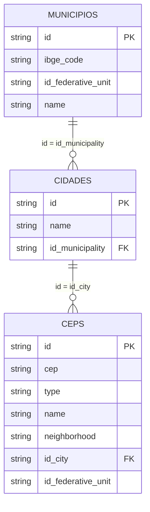

# Base de CEPs do Brasil

Este repositório contém dados de municípios, cidades/localidades e endereços postais do Brasil em arquivos CSV. Os arquivos de CEP são separados por unidade federativa (UF), mas compartilham o mesmo formato e podem ser reunidos em uma única tabela.

## Arquivos

| Arquivo | Registros | Conteúdo |
| --- | ---: | --- |
| `municipios.csv` | 5.570 | Cadastro de municípios, com código IBGE, UF, nome e ID interno. |
| `cidades.csv` | 5.656 | Cadastro de cidades/localidades associado aos municípios. |
| `cep_<uf>.csv` | 1.607.998 no total | Endereços e CEPs. Há um arquivo para cada uma das 27 UFs, por exemplo `cep_ac.csv`, `cep_df.csv` e `cep_sp.csv`. |

Todos os arquivos usam vírgula como separador e possuem uma linha de cabeçalho. Campos textuais podem estar entre aspas e podem conter vírgulas; por isso, devem ser lidos com um parser de CSV, e não com uma simples divisão da linha por vírgulas.

## Origem dos Dados

As informações deste repositório — CEPs, logradouros, bairros, cidades e municípios — foram obtidas de **fontes públicas**. Endereços postais e códigos de CEP são dados de uso comum; a legislação brasileira não reconhece direito autoral sobre os fatos em si (por exemplo, o CEP `01001-000` associado à Praça da Sé).

Esta base é uma compilação independente, organizada para uso comunitário. Não se trata da redistribuição do Diretório Nacional de Endereços (DNE) dos Correios, produto comercial proprietário sujeito a contrato de licença.

## Relação entre os IDs



O encadeamento correto é:

1. `municipios.id` é referenciado por `cidades.id_municipality`.
2. `cidades.id` é referenciado por `cep_<uf>.id_city`.
3. A partir de um registro de CEP, portanto, chega-se ao município por meio da cidade/localidade.

Não se deve relacionar as tabelas pelos nomes, pois eles podem se repetir ou representar níveis diferentes de localidade.

### Exemplo real

O endereço `Alameda Acará`, de CEP `69915670`, em `cep_ac.csv`, possui:

```text
id_city = bb6b79c9-7741-4185-90fd-8ef556cd9ab6
```

Esse valor encontra `cidades.id` para `Rio Branco`. O registro da cidade contém:

```text
id_municipality = 01a02d5a-89a9-735b-ab42-2dbd9d31eb00
```

Por fim, esse valor encontra `municipios.id` para o município de `Rio Branco`, código IBGE `1200401`, no Acre.

## Colunas

### `municipios.csv`

| Coluna | Descrição |
| --- | --- |
| `ibge_code` | Código oficial do município no IBGE. É um identificador externo e não substitui `id` nos relacionamentos desta base. |
| `id_federative_unit` | Sigla da UF, como `AC`, `SP` ou `DF`. Apesar do nome, não referencia outra tabela deste repositório. |
| `name` | Nome do município. |
| `id` | Identificador interno do município, em formato UUID. Chave primária referenciada por `cidades.id_municipality`. |

### `cidades.csv`

| Coluna | Descrição |
| --- | --- |
| `id` | Identificador interno da cidade/localidade, em formato UUID. Chave primária referenciada por `cep_<uf>.id_city`. |
| `name` | Nome da cidade ou localidade. |
| `id_municipality` | Identificador do município ao qual a cidade/localidade pertence. Chave estrangeira para `municipios.id`. |

`cidades.csv` não possui uma relação obrigatoriamente um para um com `municipios.csv`. Um município pode conter várias localidades. Por exemplo, Santa Teresa/ES possui entradas para Santa Teresa, Alto Caldeirão, Alto Santa Maria, São João de Petrópolis, Vinte e Cinco de Julho e Santo Antônio do Canaã.

### `cep_<uf>.csv`

| Coluna | Descrição |
| --- | --- |
| `id` | Identificador interno e único do registro de endereço, em formato UUID. |
| `cep` | CEP com oito dígitos e sem hífen. Deve ser tratado como texto para preservar zeros à esquerda. Não deve ser usado como chave primária, pois um CEP pode aparecer em mais de um registro. |
| `type` | Tipo do logradouro, como `rua`, `avenida`, `alameda` ou `travessa`. |
| `name` | Nome do logradouro conforme fornecido na base. |
| `neighborhood` | Bairro. Pode estar vazio. |
| `id_city` | Chave estrangeira para `cidades.id`. |
| `id_federative_unit` | Sigla da UF. Deve coincidir com o sufixo do arquivo; por exemplo, registros de `cep_sp.csv` usam `SP`. |

## Exemplo de consulta

Após importar os arquivos para tabelas `municipios`, `cidades` e `ceps`, a consulta completa pode ser feita assim:

```sql
SELECT
    cep.cep,
    cep.type,
    cep.name AS logradouro,
    cep.neighborhood AS bairro,
    cidade.name AS cidade,
    municipio.name AS municipio,
    municipio.ibge_code,
    municipio.id_federative_unit AS uf
FROM ceps AS cep
JOIN cidades AS cidade
    ON cidade.id = cep.id_city
JOIN municipios AS municipio
    ON municipio.id = cidade.id_municipality;
```

Para formar a tabela `ceps`, basta importar ou unir as linhas dos 27 arquivos `cep_<uf>.csv`, mantendo apenas um cabeçalho.

## Ordem recomendada de importação

Para bancos com restrições de chave estrangeira, use esta ordem:

1. `municipios.csv`;
2. `cidades.csv`;
3. arquivos `cep_<uf>.csv`.

Recomenda-se armazenar `id`, `id_municipality` e `id_city` como UUID ou texto; `ibge_code`, `cep` e `id_federative_unit` como texto; e os demais campos como texto Unicode.

## Integridade observada

Na versão atual dos arquivos:

- os IDs de municípios, cidades e registros de CEP não se repetem em suas respectivas entidades;
- todas as 5.656 cidades/localidades apontam para um `municipios.id` existente;
- todos os 1.607.998 registros de CEP apontam para um `cidades.id` existente;
- a UF de todos os registros coincide com o nome do arquivo e com a UF do município alcançado pelos relacionamentos;
- 62 municípios possuem mais de uma cidade/localidade cadastrada e 5 municípios não possuem entrada em `cidades.csv`.

___

Se este repositório ajudou você, considere contribuir deixando uma estrela.
